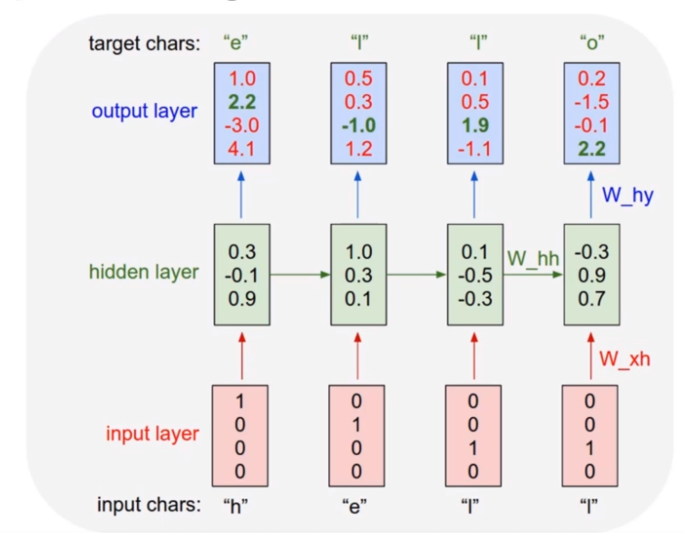

# Machine Learning Notes
These are assorted notes on topics from various courses and projects.

## 1. End-end-process
1. Data sourcing  - train_test_split
2. Exploratory data analysis - plot distributions, correlations
3. Data cleaning - drop redundant columns, handle missing data (drop or impute)
4. Feature engineering - one hot encoding categories, scaling/normalising numerical values, combining columns, extracting info from columns (e.g. zip code from address) 
5. Model selection and training - model and hyperparameters
6. Model tuning and evaluation metrics - classification: classification_report, confusion matrix, accuracy, recall, F1. Regression: error (RMSE, MAE, etc)
7. Predictions


## 2. Models

### 2.1. Machine learning categories

- Supervised learning
  - SVM
  - ...
- Unsupervised learning
  - Dimensionality reduction
  - Clustering
- Reinforcement Learning

For supervised learning:
- Regression
- Classification
  - Single class
  - Multi class


### 2.2. Machine learning models

#### 2.2.1 ANN (Artificial Neural Network)
General idea of a neural network that can then be extended to specific cases, e.g. CNNs and RNNs.

- Perceptron: a weighted average of inputs passed through some activation gate function to arrive at an output decision
- Network of perceptrons
- Activation function: a non-linear transfer function f(wx+b)
- Cost function and gradient descent: convex optimisation of a loss function using sub-gradient descent. The optimizer can be set in the compile method of the model.
- Backpropagation: use chain rule to determine partial gradients of each weight and bias. This means we only need a single forward pass followed by a single backward pass. Contrast this to if we perturbed each weight or bias to determine each partial gradient: in that case, for each epoch we would need to run a forward pass per weight/bias in the network, which is potentially millions! 
- Dropout: a technique to avoid overfitting by randomly dropping neurons in each epoch.

General structure:
1. Input layer
2. Hidden layer(s)
3. Output layer

Input and output layers are determined by the problem:
- Input size: number of features in the data
- Output size number of targets to predict, i.e. one for single class classification or single target regression, or multiple for multiclass (one per class)
- Output layer activation determined by problem. For single class classification `activation='sigmoid'`, for multiclass classification `activation='softmax'`
- Loss function determined by problem. For single class classification `loss='binary_crossentropy'`, for multiclass classification `loss='categorical_crossentropy'`

Hidden layers are less well-defined. Some heuristics here: https://stats.stackexchange.com/questions/181/how-to-choose-the-number-of-hidden-layers-and-nodes-in-a-feedforward-neural-netw


Vanishing gradients can be an issue for lower layers in particular, where the partial gradients of individual layers can be very small, so when multiplied together in chain rule the gradient is vanishingly small.
Exploding gradients are a similar issue but where gradients get increasingly large when multiplied together.
Some techniques to rectify vanishing/exploding gradients:
- Use different activation functions with larger gradients close to 0 and 1, e.g. leaky ReLU or ELU (exponential linear unit)
- Batch normalisation: scale each gradient by the mean and standard deviation of the batch
- Different weight initialisation methods, e.g. Xavier initialisation


Example model outline
```python
from tensorflow.keras.models import Sequential
from tensorflow.keras.layers import Dense, Dropout

model = Sequential()

# Input layer
model.add(Dense(78, activation='relu'))  # Number of input features
model.add(Dropout(0.2))  # Optional dropout layer after each layer. Omitted for next layers for clarity

# Hidden layers
model.add(Dense(39, activation='relu'))
model.add(Dense(19, activation='relu'))

# Output layer
model.add(Dense(1, activation='sigmoid'))  # Number of target classes (single class in this case)

# Problem setup
model.compile(loss='binary_crossentropy', optimizer='adam')  # Type of problem (single class classification in this case)

# Training
model.fit(
    x=X_train,
    y=y_train,
    batch_size=256,
    epochs=30,
    validation_data=(X_test, y_test)
)

# Prediction
model.predict(new_input)  # The new input needs to be shaped and scaled the sane as the training data
```


#### 2.2.2. CNN (Convolutional Neural Network)
These are used for image classification problems where convolutional filters are useful for extracting features from input arrays.

- Image kernels/filters
  - Grayscale 2D arrays
  - RGB 3D tensors
- Convolutional layers
- Pooling layers

General structure:
1. Input layer
2. Convolutional layer
3. Pooling layer
4. (Optionally more pairs of convolutional and pooling layers)
5. Flattening layer 
6. Dense hidden layer(s)
7. Output layer


Example model outline
```python
from tensorflow.keras.models import Sequential
from tensorflow.keras.layers import Dense, Conv2D, MaxPool2D, Flatten
from tensorflow.keras.callbacks import EarlyStopping

model = Sequential()

# Convolutional layer followed by pooling. Deeper networks may have multiple pairs of these.
model.add(Conv2D(filters=32, kernel_size=(4,4),input_shape=(28, 28, 1), activation='relu',))  # Input shape determined by input data size
model.add(MaxPool2D(pool_size=(2, 2)))

# Flatten images from 2D to 1D before final layer
model.add(Flatten())

# Dense hidden layer
model.add(Dense(128, activation='relu'))

# Output layer
model.add(Dense(10, activation='softmax'))  # Size and activation determined by problem; multiclass classification in this case

# Problem setup
model.compile(loss='categorical_crossentropy', optimizer='adam')  # Loss determined by problem, multiclass classification in this case

# Training (with optional early stopping)
early_stop = EarlyStopping(monitor='val_loss',patience=2)
model.fit(x_train,y_cat_train,epochs=10,validation_data=(x_test,y_cat_test),callbacks=[early_stop])

# Prediction
model.predict(new_input)  # The new input needs to be shaped and scaled the sane as the training data
```

#### 2.2.3. RNN (Recurrent Neural Network)
These are used for modelling sequences with variable lengths of inputs and outputs.

Recurrent neurons take as their input the current data AND the previous epoch's output. 
We could try to pass EVERY previous epoch's output as an input, but would run into issues of vanushing gradients.

LSTMs take this idea a step further by incorporating the previous epochs input AND some longer lookback of epoch where some old outputs are "forgotten".

A basic RNN:
```

            --------------------------------
            |                              |
 H_t-1 ---> |                              |---> H_t
            |                              |
 X_t   ---> |                              |
            |                              |
            --------------------------------

where:
H_t is the neuron's output at current epoch t
H_t-1 is the neuron's output from the previous epoch t-1
X_t is the input data at current epoch t

H_t = tanh(W[H_t-1, X_t] + b)
```

An LSTM (Long Short Term Memory) unit:
```

            --------------------------------
            |                              |
 H_t-1 ---> |                              |---> H_t
            |                              |
 C_t-1 ---> |                              |---> C_t
            |                              |
 X_t   ---> |                              |
            |                              |
            --------------------------------
            
The `forget gate` determines which part of the old short-term memory and current input is "forgotten" by the new long-term memory.
These are a set of weights (between 0 and 1) that get applied to the old long-term memory to downweight it.
F_t = sigmoid(W_F[H_t-1, X_t] + b_F)

The `input gate` i_t similarly gates the input and old short-term memory.
This will later (in the update gate) get combined  with a candidate value for the new long-term memory `C_candidate_t`
I_t = sigmoid(W_I[H_t-1, X_t] + b_I)
C_candidate_t = tanh(W_C_cand[H_t-1, X_t] + b_C_cand) 

The `update gate` for the new long-term memory `C_t` is then calculated as a sum of forgotten old memory and input-weighted candidate memory:
C_t = F_t*C_t-1 + I_t*C_candidate_t 

The `output gate` O_t is a combination of the old short-term memory and latest input data.
This is then combined with the latest long-term memory to produce the output of the recurrent neuron, which is also the updated short-term memory H_t:
O_t = sigmoid(W_O[H_t-1, X_t] + b_O)
H_t = O_t * tanh(C_t) 

where:
H_t is short-term memory at epoch t
C_t is long-term memory at epoch t
X_t is the input data at current epoch t

sigmoid is a sigmoid  activation function
F_t is an intermediate forget gate weight
I_t is an intermediate input gate weight
O_t is an intermediate output gate weight
```


There are several variants of RNNs.
*RNNs with peepholes*
This leaks long-term memory into the forget, input and output gates.
Note that the forget gate and input gate each get the OLD long-term memory, whereas the output gate gets the NEW long-term memory.
```
F_t = sigmoid(W_F[C_t-1, H_t-1, X_t] + b_F)
I_t = sigmoid(W_I[C_t-1, H_t-1, X_t] + b_I)
O_t = sigmoid(W_O[C_t, H_t-1, X_t] + b_O)
```

*Gated Recurrent Unit (GRU)*
This combines the forget and input gates into a single gate. It also has some other changes.
This is simpler than a typical LSTM model as it has fewer parameters. This makes it more computationally efficient, and in practice they can have similar performance.
```
z_t = sigmoid(W_z[H_t-1, X_t])
r_t = sigmoid(W_r[H_t-1, X_t])
H_candidate_t = tanh(W_H_candidate[r_t*h_t-1, x_t])
H_t = (1 - z_t) * H_t-1 + z_t * H_candidate_t
```


The sequences modelled with RNNs can be:
- One-to-many
- Many-to-many
- Many-to-one


Considerations for choosing the input sequence length:
- It should be long enough to capture any patterns or seasonality in the data
- The validation set and test set each need to have a size at least (input_length + output_length), so the longer the input length, the more data is required to be set aside.


The validation loss for RNNs/LSTMs can be volatile, so allow a higher patience when using early stopping.


Example model
```python
from tensorflow.keras.callbacks import EarlyStopping
from tensorflow.keras.preprocessing.sequence import TimeseriesGenerator
from tensorflow.keras.models import Sequential
from tensorflow.keras.layers import Dense,LSTM

# Generators for helper functions to chunk up the input series into an array of pairs of (input_batch, target_output)
train_generator = TimeseriesGenerator(scaled_train, scaled_train, length=batch_length, batch_size=1)
validation_generator = TimeseriesGenerator(scaled_test, scaled_test, length=batch_length, batch_size=1)

# Create an LSTM model
model = Sequential()
model.add(LSTM(100, activation='relu', input_shape=(batch_length, n_features)))
model.add(Dense(1))  # Output layer
model.compile(optimizer='adam', loss='mse')  # Problem setup for regression

# Fit the model
early_stop = EarlyStopping(monitor='val_loss', patience=10)  # RNNs can be volatile so if use a higher patience with an early stopping callback
model.fit(train_generator, epochs=20, validation_data=validation_generator, callbacks=[early_stop])

# Evaluate test data
test_predictions = []
final_batch = scaled_train[-batch_length:, :]
current_batch = final_batch.reshape((1, batch_length, n_features))

for test_val in scaled_test:
    pred_val = model.predict(current_batch)  # These will later need to use the scaler.inverse_transform of the scaler originally used on the training data
    test_predictions.append(pred_val[0])
    current_batch = np.append(current_batch[:,1:,:], pred_val.reshape(1,1,1), axis=1)
```


#### 2.2.4 NLP
Character-based generative NLP: 
given an input string, e.g. ['h', 'e', 'l', 'l'],
predict the sequence shifted by one character, e.g. ['e', 'l', 'l', 'o']

The embedding, GRU and dense layers work on the sequence in the following way:


Steps:
1. Read in text data
2. Text processing and vectorisation - one-hot encoding
3. Create batches
4. Create the model
5. Train the model
6. Generate new text

**Step 1: Read in text data**
- A corpus of >1 million characters is a good size
- The more distinct the style of your corpus, the more obvious it will be if your model has worked.

Given some structured `input_text` string, we can get the one-hot encoded vocab list of unique characters.
```python
vocab_list = sorted(set(input_text))
```

**Step 2: Text processing**
Vectorise the text - create a mapping between character and integer. 
This is the encoding dictionary used to vectorise the corpus.
 
```python
# Mappings back and forth between characters and their encoded integers
char_to_ind = {char: ind for ind, char in enumerate(vocab_list)}
ind_to_char = {ind: char for ind, char in enumerate(vocab_list)}

encoded_text = np.array([char_to_ind[char] for char in input_text])
```


**Step 3: Create batches**
The sequence length should be long enough to capture structure, e.g. for poetry with rhyming couplets it should be 
the number of characters in 3 lines to capture the rhyme and non-rhyme. 
Too long a sequence makes the model take longer to train and captures too much historical noise.

Create a shuffled dataset where:
- input sequence is the first n characters
- output sequence is n characters lagged by one

We want to shuffle these sequence pairs into a random order so the model doesn't overfit to any section of the text, 
but can instead generate characters given any seed text.

```python
seq_len = 120
total_num_seq = len(input_text) // (seq_len + 1)

# Create Training Sequences
char_dataset = tf.data.Dataset.from_tensor_slices(encoded_text)
sequences = char_dataset.batch(seq_len + 1, drop_remainder=True)  # drop_remainder drops the last incomplete sequence

# Create tuples of input and output sequences
def create_seq_targets(seq):
    input_seq = seq[:-1]
    output_seq = seq[-1:]
    return input_seq, output_seq
dataset = sequences.map(create_seq_targets)

# Generate training batches
batch_size = 128
buffer_size = 10000  # Shuffle this amount of batches rather than shuffling the entire dataset in memory
dataset = dataset.shuffle(buffer_size).batch(batch_size, drop_remainder=True)
```


**Step 4: Create the model**
Set up the loss function and layers.

This model uses 3 layers:
   1. Embedding
      - Embed positive integers, e.g. "a"<->1, as dense vectors of fixed size. This embedding size is a hyperparameter for the user to decide.
      - Number of layers should be smaller but a similar scale to the vocab size; typically use the power of 2 
        that is just smaller than the vocab size.
   2. GRU
      - This is the main thing to vary in the model: 
        number of hidden layers and number of neurons in each, types of neurons (RNN, LSTM, GRU), etc.
        Typically use lots of layers here.
   3. Dense 
      - One neuron per character (one-hot encoded), so this produces a probability per character. 
        The user can vary the "temperature", choosing less probable characters more/less often.


Loss function: 
- Sparse categorical cross-entropy 
- Use *sparse* categorical cross-entropy because the classes are mutually exclusive. 
  Use regular categorical cross-entropy when one smaple can have multiple classes, or the labels are soft probabilities.
- See link in NLP appendix for discussion.
- Use logits=True because vocab input is one hot encoded.


```python
from tensorflow.keras.models import Sequential
from tensorflow.keras.layers import LSTM, Dense, Embedding, Dropout, GRU
from tensorflow.keras.losses import sparse_categorical_crossentropy

# Hyperparameters
vocab_size = len(vocab_list)
embed_dim = 64
rnn_neurons = 1026

# Create model 
model = Sequential()
model.add(Embedding(vocab_size, embed_dim, batch_input_shape=[batch_size, None]))
model.add(GRU(rnn_neurons, return_sequences=True, stateful=True, recurrent_initializer='glorot_uniform'))
model.add(Dense(vocab_size))
sparse_cat_loss = lambda y_true,y_pred: sparse_categorical_crossentropy(y_true, y_pred, from_logits=True)  # We want a custom loss function with logits=True
model.compile(optimizer='adam', loss=sparse_cat_loss) 
```


**Step 5: Train the model**
```python
epochs = 30
model.fit(dataset,epochs=epochs)
```

**Step 6: Generate text**
Allow the model to accept a batch size of 1 to allow us to give an input seed text from which to generate text from.

We format the seed text so it can be fed into the network, 
then loop through generating one character at a time and feeding that back into the model.

```python
model.build(tf.TensorShape([1, None]))

def generate_text(model, input_seed_text, gen_size=100, temperature=1.0):
    """
    model: tensorflow.model
    input_seed_text: str
    gen_size: int
    temperature: float
    """
    generated_text_result = []
    vectorised_seed = tf.expand_dims([char_to_ind[s] for s in input_seed_text], 0)
    model.reset_states()
    
    for k in range(gen_size):
        raw_predictions = model(vectorised_seed)
        predictions = tf.squeeze(raw_predictions, 0) / temperature
        predicted_index = tf.random.categorical(predictions, num_samples=1)[-1,0].numpy()
        generated_text_result.append(ind_to_char[predicted_index])
        
        # Set a new vectorised seed to generate the next character in the loop
        vectorised_seed = tf.expand_dims([predicted_index], 0)
        
    return (input_seed_text + ''.join(generated_text_result))
```


#### 2.2.5 AutoEncoders
This is an unsupervised learning problem, therefore evaluation metrics are different.
Sometimes called semi-supervised as labels may be used in training the model,
but not available when it's used to predict new values.

Applications:
- Dimensionality reduction
- Noise removal

Designed to reproduce its input in the output layer. Number of input neurons is the same as the number of output layers.
The encoder reduces dimensionality to the hidden layer.
The hidden layer should contain the most relevant information required to reconstruct the input.
The decoder reconstructs a high dimensional output from a low dimensional input.

- Encoder: Input layer -> Hidden layer 
- Decoder: Hidden layer -> Output

Stacked autoencoders include multiple hidden layers.


**Autoencoder for dimensionality reduction**
Let's try to reduce an input dataset from 3 dimensions to 2.
We want to train an autoencoder to go from 3 -> 2 -> 3.

When we scale data, we fit and transform on the entire dataset rather than a train/test split,
because there is no ground truth for the "correct" dimensionality reduction.

Using SGD in Autoencoders allows the learning rate to be varied as a hyperparameter to affect how well the hidden layer learns.
Larger values will train quicker but potentially perform worse.

To retrieve the lower dimensionality representation, use *just the encoder* half of the trained autoencoder to predict the input.


```python
# Scale data
scaler = MinMaxScaler()
scaled_data = scaler.fit_transform(input_features)

# Create model
encoder = Sequential()
encoder.add(Dense(units=2, acivation='relu', input_shape=[3]))

decoder = Sequential()
decoder.add(Dense(units=3, acivation='relu', input_shape=[2]))

autoencoder = Sequential([encoder, decoder])
autoencoder.compile(loss='mse', optimizer=SGD(lr=1.5))

# Train the full autoencoder model
autoencoder.fit(scaled_data, scaled_data, epochs=5)

# Reduce dimensionality by using just the encoder part of the trained model
encoded_2dim = encoder.predict(scaled_data)
```

**Autoencoder for noise removal**
Starting with clean images, we want to train an autoencoder to learn to remove noise.
We create a noisy dataset by adding noise to our clean images. 
We then try to reconstruct that input, and compare to the original clean images as the ground truth.

Starting with 28x28 images (e.g. MNIST dataset), this gives 784 input features when flattened.
Use multiple hidden layers as there are a large number of input features that would be difficult to learn in one layer.
The numbers of layers and number of neurons in each are hyperparameters to tune; decreasing in powers of 2 is a good rule of thumb.

Add a Gaussian noise layer to train the model to remove noise.
Without the Gaussian layer, the model would be used for dimensionality reduction rather than noise removal.

The final layer uses a sigmoid activation because it is a binary classification problem - does the output match the input?

```python
encoder = Sequential()
encoder.add(Flatten(input_shape=[28, 28]))
encoder.add(Gaussian(0.2))  # Optional layer if training for noise removal rather than dimensionality reduction
encoder.add(Dense(400, activation='relu'))
encoder.add(Dense(200, activation='relu'))
encoder.add(Dense(100, activation='relu'))
encoder.add(Dense(50, activation='relu'))
encoder.add(Dense(25, activation='relu'))

decoder = Sequential()
decoder.add(Dense(50, input_shape=[25], activation='relu'))
decoder.add(Dense(100, activation='relu'))
decoder.add(Dense(200, activation='relu'))
decoder.add(Dense(400, activation='relu'))
decoder.add(Dense(28*28, activation='sigmoid'))

autoencoder = Sequential([encoder, decoder])
autoencoder.compile(loss='binary_crossentropy', optimizer=SGD(lr=1.5), metrics=['accuracy'])
autoencoder.fit(X_train, X_train, epochs=5)
```


#### 2.2.6 Generative Adversarial Networks (GANs)
Use 2 networks competing against each other to generate data - counterfeiter (generator) vs detective (discriminator).
- Generator: recieves random noise
- Discriminator: receives data set containing real data and fake generated data, and attempts to calssify real vs fake (binary classificaiton).


Two training phases, each only training one of the networks:
1. Train discriminator - real images (labeled 1) and generated images (labeled 0) are fed to the discriminator network.
2. Train generator - only feed generated images to discriminator, ALL labeled 1.

The generator never sees real images, it creates images based only off of the gradients flowing back from the discriminator.


Difficulties with GANs:
1. Training resources - GPUs generally required
2. Mode collapse - generator learns an image that fools the discriminator, then only produces this image. Deep convolutional GANs and mini-batch discrimination are two solution to this problem.
3. Instability - True performance is hard to measure; just because the discriminator was fooled, it doesn't mean that the generated image was actually realistic.


**Creating the model**
We create the generator and discriminator as separate models, then join them into a GAN object. 
This is analogous to how we joined an encoder and decoder into an autoencoder.

The discriminator is trained on a binary classification problem, real or fake, so uses a binary cross entropy loss function.
Backpropagation only alters the weights of the discriminator in the first phase, not the generator.

```python
discriminator = Sequential()

# Flatten the image
discriminator.add(Flatten(input_shape=[28,28]))

# Some hidden layers
discriminator.add(Dense(150,activation='relu'))
discriminator.add(Dense(100,activation='relu'))

# Binary classification - real vs fake
discriminator.add(Dense(1,activation="sigmoid"))
discriminator.compile(loss="binary_crossentropy", optimizer="adam")
```

The generator is trained in the second phase.

We set a codings_size, which is the size of the latent representation from which the generator will create a full image.
For example, if we want to create a 28x28 image (784 pixels), we may want to generate this from a 100 element input.
This is analogous to the decoder part of an autoencoder.

The codings_size should be smaller than the total number of features but large enough so that there is something to learn from.

The generator is NOT compiled at this step, it is compiled in the combined GAN later so that it is only trained at that step.
```python
codings_size = 100
generator = Sequential()

# Input shape of first layer is the codings_size
generator.add(Dense(150, activation="relu", input_shape=[codings_size]))

# Some hidden layers
generator.add(Dense(200,activation='relu'))

# Output is the size of the image we want to create
generator.add(Dense(784, activation="sigmoid"))
generator.add(Reshape([28,28]))
```


The GAN combines the generator and discriminator.

The discriminator is only trained in the first phase, not the second phase.
```python
GAN = Sequential([generator, discriminator])
discriminator.trainable = False
GAN.compile(loss="binary_crossentropy", optimizer="adam")
```


**Training the model**
We first create batches of images from our input data, similarly to previous models.

```python
batch_size = 32  # Size of training input batches
buffer_size = 1000  # Don't load the entire dataset into memory
epochs = 1

raw_dataset = tf.data.Dataset.from_tensor_slices(X_train).shuffle(buffer_size=buffer_size)
batched_dataset = raw_dataset.batch(batch_size, drop_remainder=True).prefetch(1)
```

The training loop for each epoch trains the discriminator to distinguish real vs fake images (binary classification).
Then it trains the generator to generate fake images using ONLY the gradients learned in the discriminator training step; 
the generator NEVER sees any real images. 

```python
generator, discriminator = GAN.layers

for epoch in range(epochs):
    for index, X_batch in enumerate(batched_dataset):
        # Phase 1: Train the discriminator
        noise = tf.random.normal(shape=[batch_size, codings_size])
        generated_images = generator(noise)
        real_images = tf.dtypes.cast(X_batch,tf.float32)
        X_train_discriminator = tf.concat([generated_images, real_images], axis=0)
        y_train_discriminator = tf.constant([[0.]] * batch_size + [[1.]] * batch_size)  # Targets set to zero for fake images and 1 for real images
        discriminator.trainable = True
        discriminator.train_on_batch(X_train_discriminator, y_train_discriminator)

        # Phase 2: Train the generator
        noise = tf.random.normal(shape=[batch_size, codings_size])
        y_train_generator = tf.constant([[1.]] * batch_size)  # We want discriminator to believe that fake images are real
        discriminator.trainable = False
        GAN.train_on_batch(noise, y_train_generator)    
```


**Deep convolutional GANs**
These are GANs which use convolutional layers inside the discriminator and generator models.

The models are almost identical to the models above, just with additional Conv2D, Conv2DTranspose and BatchNormalization layers. 

Changes compared to regular GANs:
- Additional convolutional layers in model. 
- Reshape the training set to match the images.
- Rescale the training data to be between -1 and 1 so that tanh activation function works.
- Activation of discriminator output layer is tanh rather than sigmoid.


## A. Appendix
### A.1. Useful resources
Neural networks:
- Intuition behind neural networks http://neuralnetworksanddeeplearning.com/
- The deep learning bible (with lectures) https://www.deeplearningbook.org/
- Udemy course: https://www.udemy.com/course/complete-tensorflow-2-and-keras-deep-learning-bootcamp
- Heuristics for choosing hidden layers https://stats.stackexchange.com/questions/181/how-to-choose-the-number-of-hidden-layers-and-nodes-in-a-feedforward-neural-netw
- Alternatives to the deprecated model predict for different classification problems https://stackoverflow.com/questions/68776790/model-predict-classes-is-deprecated-what-to-use-instead

CNNs:
- Image kernels explained https://setosa.io/ev/image-kernels/
- Choosing CNN layers https://stats.stackexchange.com/questions/148139/rules-for-selecting-convolutional-neural-network-hyperparameters

RNNs:
- Overview of RNNs http://karpathy.github.io/2015/05/21/rnn-effectiveness/
- Wikipedia page contains the equations of LSTMs and peepholes https://en.wikipedia.org/wiki/Long_short-term_memory
- LSTMs vs GRUs https://datascience.stackexchange.com/questions/14581/when-to-use-gru-over-lstm 
- Worked example of LSTM http://blog.echen.me/2017/05/30/exploring-lstms/

NLP:
- The unreasonable effectiveness of RNNs, essay on RNNs applied to NLP http://karpathy.github.io/2015/05/21/rnn-effectiveness/
- Sparse vs dense categorical crossentropy loss function https://datascience.stackexchange.com/questions/41921/sparse-categorical-crossentropy-vs-categorical-crossentropy-keras-accuracy

GANs:
- buffer_size argument in tensorflow rpefetch and shuffle https://stackoverflow.com/questions/46444018/meaning-of-buffer-size-in-dataset-map-dataset-prefetch-and-dataset-shuffle
- Mode collapse https://www.quora.com/What-does-it-mean-if-all-produced-images-of-a-GAN-look-the-same