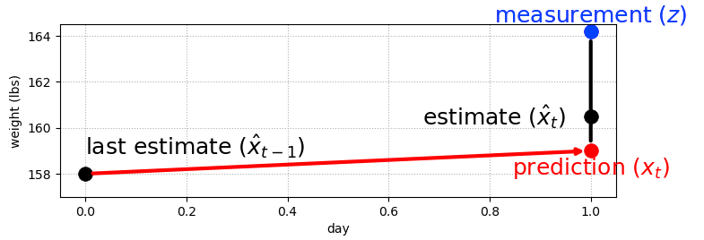

# Kalman filter
Notes from https://github.com/rlabbe/Kalman-and-Bayesian-Filters-in-Python

## 1. g-h filters 
### Combining predictions and measurements
With measurements from 2 noisy sensors, we can combine them to get a much more accurate measurement. **Never throw data away.** 

If we have a prediction model for how the world evolves (e.g. predicted daily weight gain) we can combine this with noisy measurements in the same way.
Treat the prediction as a noisy sensor and combine as before, so that our estimate is some way between the prediction and the estimate.
How close it is to one or the other depends on the relative accuracy of each, and this is a hyperparameter we can set. 

```
prediction =  x_est + dx*dt 

where:
`x_est` is an initial constant that gets updated
`dx` is a predicted daily weight gain rate
`dt` is the time step
```

### g filter
We can create a single parameter filter, where the parameter `g` corresponds to how strongly we 
trust the prediction over the measurement
```
residual = prediction - measurement
estimate = measurement + g * residual
```
- `g=0 => estimate=measurement`
- `g=1 => estimate=prediction`
- for other values of `g`, the estimate will be somewhere between the measurement and prediction
 


### g-h filter
We can go one step further and use our noisy estimates of weight to refine our the daily weight gain w used in our prediction
```
dx_t+1 = dx_t + h * residual / dt
```

This gives us the g-h filter - a generic filter which allows us to set a parameter g for the weight measurement confidence
and h for the weight change measurement confidence.

We can then update the estimates for weight and weight change on every time step 
(or every measurement if time steps are irregular). 

This insight forms the basis for Kalman filters, where we will set g and h dynamically on each time step. 

### Conclusion
Key takeaways:
- Multiple data points are more accurate than one data point, so throw nothing away no matter how inaccurate it is.
- Always choose a number part way between two data points to create a more accurate estimate.
- Predict the next measurement and rate of change based on the current estimate and how much we think it will change.
- The new estimate is then chosen as part way between the prediction and next measurement scaled by how accurate each is.
- The filter is only as good as the mathematical model used to express the system.
- Filters are designed, not selected ad hoc. No choice of g and h applies to all scenarios.

Terminology:
- System - the object we want to estimate
- State, `x` - the current configuration of the system. Hidden.
- Measurement, `z` - measured value of the state from a noisy sensor. Observable.
- State estimate - our filter's estimate of the state.
- Process model - the model we use to predict the next state based on the current state.
- System propagation - the predict step
- Measurement update - the update step
- Epoch - one iteration of system propagation and measurement update.


## 2. Discrete Bayes filter
### Bayesian vs Frequentist
Bayesian statistics treats probability as a belief about a single event. 
Frequentist statistics describes past events based on their frequency. It has no bearing on future events.

If I flip a coin 100 times and get 50 heads and 50 tails, frequentist statistics states the probability of heads _was_ 50%
for those cases.
On the next coin flip, frequentist statistics has nothing to say about the probability. The state is simply unknown.
Bayesian statistics incorporates these past events as a prior belief, so that we can say the next coin flip has a 50% chance
of landing heads. "Belief" is a measure of the strength of our knowledge.

When talking about the probability of something, we are implicitly saying "the probability that this event is true given past events".
This is a Bayesian approach. In practice, we may incorporate frequentist techniques too, as in the example above when the 100 previous 
coin tosses were used to inform our prior.

- Prior is the probability distribution before including the measurement's information. This corresponds to the prediction in the Kalman filter.
- Posterior is a probability distribution after incorporating the measurement's information. This corresponds to the estimated state in the Kalman filter.
- Likelihood is the joint probability of the observed data - how likely is each position given the measurement. This is not a probability distribution as it does not sum to 1.

The filter will use Bayes theorem:
```
posterior = likelihood * prior / normalization
```
In even simpler filter terms:
```
udpated knowledge = || likelihood of new knowledge * prior knowledge ||
```

If we have a prior distribution of positions and system model of the subsequent movement, 
we can convolve the two to calculate the posterior.

### Discrete Bayes filter
The discrete Bayes filter is a form of g-h filter.
It is useful for multimodal, discrete problems.

The equations are:
```
Predict step:
x_bar = x * f_x(.)
where:
- x is the current state
- f_x(.) is the state propagation function for x, i.e. the system model.


Update step:
x = ||L . x_bar||
where:
- L is the likely function
```

In pseudocode this is:
```
Initialisation:
1. Initialise our belief in the state.

Predict:
1. Predict state for the next time step using the system model.
2. Adjust belief to account for uncertainty in prediction.

Update:
1. Get a measurement and belief about its accuracy (noise estimate).
2. Compute likelihood of measurement matching each state.
3. Update posterior state belief based on likelihood.
```

Algorithms of this form a called "predictor correctors"; we make a prediction then correct it.
The predict step will always degrade our knowledge due to the uncertainty in the second step of the predict stage.
But adding another measurement, even if noisy, improves our knowledge again.
So we can converge on the most likely result.

### Evaluation of discrete Bayes filter
The algorithm is trivial to implement, debug and understand. 

Limitations:
- Scaling - Tracking i state variables results in O(n^i) runtime complexity.
- Discrete - Most real-world examples are continuous. We can increase the granularity to get a discrete approximation of 
             continuous measurements, but this increases the scale again.
- Multimodal - Sometimes you require a single output value.
- Needs a state change measurement.

The Kalman filter is based on the same idea that we can use Bayesian reasoning to combine measurements and system models.
The fundamental insight in this chapter is that we multiply (convolve) probabilities when we measure 
and shift probabilities when we update, which leads to a converging solution.


## 3. Probability and Gaussians
Gaussian distributions address some of the limitations of the discrete Bayes filter, as they are continuous and unimodal.

### Probability
- Random variables - the possible values and associated probabilities of a particular event. Denoted with capital letter, e.g. `X`
- Sample space - the range of values a random variable can take. This is not unique, e.g. for a dice roll could be {1,2,3,4,5,6}, or {even,odd} or {d}
- Probability distribution -  the probability for the random variable to take any value in the sample space. 
  Probability _distribution_ denoted with lower case p, and probability of a single event denoted with upper case P, e.g. `P(X=1) = p(1)`
- Total probability - Probabilities are non-negative and sum/integrate to 1.
- Summary statistics - mean, median, mode
- Expected value is the probability-weighted mean of values. This equals the mean if the probability distribution is uniform.
  `E[X] = \sum{p_i x_i}`
  `mean = \sum{x_i}/n`
- Variance - `var(X) = E[(x-mu)^2] = \sum{(x_i - mu)^2}/n`
  The square in the variance (rather han absolute value) is somewhat arbitrary, 
  and reflects that the sign of the deviation shouldn't matter and larger deviations are "worse" than smaller deviations.
  Precision is sometimes used which is the inverse of the variance.

### Gaussians
Continuous, unimodal probability distributions.

```
f(x, mu, sigma) = (1 / sigma sqrt(2*pi)) * e^(-(x-mu)^2/2*sigma^2)

which, removing constants, is proportional to
e^-x^2
```

The probability of a single point is infinitesimally small. 
We can think of this in Bayesian terms or frequentist terms.
As a Bayesian, if the thermometer reads exactly 22°C, then our belief is described by the Gaussian curve; 
our belief that the actual (system) temperature is near 22°C is very high, and our belief that the actual temperature is,
say,  near 18 is very low. 
As a frequentist we would say that if we took 1 billion temperature measurements of a system at exactly 22°C,
then a histogram of the measurements would look like a Gaussian curve.

Gaussians are nice to work with because the sum of independent Gaussian random variables is another Gaussian random variable.
The product of Gaussian distributions will be a Gaussian function, i.e. it is Gaussian but may not sum to 1 so will need to be scaled.
Sum of two Gaussians:
- mu = mu_1 + mu_2
- var = var_1 + var_2
Product of two Gaussians:
- mu = (var_1*mu_2 + var_2*mu_1) / (var_1 + var_2)
- var = (var_1*var_2) / (var_1 + var_2)

They also mean we can summarise/approximate large datasets with only two numbers: mean and variance.

Bayes theorem applies to probability distribution functions (p) just like it does to individual events (P).
From the general form of Bayes theorem:
```
p(A|B) = p(B|A)p(A)/p(B)
```
Recasting this for the sensor problem, where A=x_i (the position) and B=z ())sensor reading):
```
p(x_i|z) = p(z|x_i)p(x_i)/p(z)
```
- `p(z|x_i)` is the likelihood - the probability that we get the sensor measurement `z` at each position `x_i` 
- `p(x_i)` is the prior - our belief before incorporating the measurement
- `p(x_i)` is the evidence - in practice this is often an intractable integral which we can sidestep by treating this as a normalisation factor, as we know the posterior pdf must sum to 1.
- `p(x_i|z)` is the posterior - this is typically a hard question to answer, but using Bayes we can substitute it with the easier
                                question answered by the likelihood and prior.
                                Rather than answering "what is the probability of cancer given this test result" (hard problem)
                                we instead answer "what is the probability of this test result given someone has cancer" (easier problem)


### Limitations
A limitation of using Gaussians to model physical systems is that it has infinitely long tails, but in practice many physical
quantities have hard bounds, e.g. weight cannot be negative. Under a Gaussian assumption, model people's weight as a Gaussian
would suggest there is a miniscule chance that someone weights 1000000kg, which is obviously wrong.

This can impact the performance of Kalman filters as they rely on assumptions of Gaussian noise, which aren't strictly true.


## 4. One-dimensional Kalman filter
A filter to track one state variable, position.
A Kalman filter is essentially a Bayesian filter that uses Gaussians, so combines the previous two chapters.


## References
- "Artificial Intelligence for Robotics". https://www.udacity.com/course/cs373
- Think Stats ebook https://greenteapress.com/thinkstats/
