# System Design

Steps:
1. Requirements engineering
2. Capacity estimation
3. Data modeling
4. API design
5. System design
6. Design discussion


## 1. Requirements engineering
Functional and non-functional requirements.
Scale of the system.

### 1.1. Functional requirements
What the system should do.
- Which problem does the system solve
- Which features are essential to solve these problems

Core features: bare minimum required to solve the user's problem.
Support features: features that help the user solve their problem more conveniently.

### 1.2. Non-functional requirements
What the system should handle.

>**Interview tips**
> - Identify the non-functional requirements the interviewer cares most about
> - Show awareness of system attributes, trade-offs and user experience

System analysis:
- Read or write heavy?
  - Impacts requirements for database scaling, redundancy of services, effectiveness of caching.
  - System priorities - is it worse if the system fails to read or to write?
- Monolithic or distributed architecture?
  - Scale is the key consideration. Large scale applications must be distributed, smaller scale can be single server.
- Data availability vs consistency
  - CAP trilemma - A system can have only two of: Consistency, Availability, Partition tolerance
  - Choice determines the impact of a network failure

Non-functional requirements:
- Availability - How long is the system up and running per year?
  - Availability of a system is the **product** of its components' availability
  - Reliability, redundancy, fault tolerance
- Consistency - Data appears the same on all nodes regardless of the user and location.
  - Linearizability
- Scalability - Ability of a system to handle fast-growing user base and temporary load spikes
  - Vertical scaling - single server that we add more CPU/RAM to
    - Pros: fast inter-process communication, data consistency
    - Cons: single point of failure, hardware limits on maximum scale
  - Horizontal scaling - cluster of servers in parallel
    - Pros: redundancy improves availability, linear cost of scaling
    - Cons: complex architecture, data inconsistency
- Latency - Amount of time taken for a single message to be delivered
  - Experienced latency = network latency + system latency
  - Database and data model choices affect latency
  - Caching can be effective
- Compatibility - Ability of a system to operate seamlessly with other software, hardware and systems
- Security
  - Basic security measures: TLS encrypted network traffic, API keys for rate limiting

Non-functional requirements depend heavily on expected scale. 
The following help quantify expected scale, and relate to capacity estimation in the next step.
- Daily active users (DAU)
- Peak active users
- Interactions per user - including read/write ratio
- Request size
- Replication factor - determines the storage requirement (typically 3x)


## 2. Capacity Estimation
>**Interview tips**
> - Simplify wherever you can - simple assumptions and round heavily
> - Convert all numbers to scientific notation
> - Know powers of 2

### 2.1. Throughput
Requests per second (RPS) is the key measure.

```
Requests per day = Daily active users * Activities per user
Requests per second = RPD / 10^5
Peak load = RPS * Peak load factor
```

Read/write ratio is important to get the total requests.
Usually, information on either reads or writes is missing and must be inferred using the other.

```
Total RPS = Read RPS + Write RPS
```

### 2.2. Bandwidth
The amount of data that can be transmitted between two nodes in a fixed period of time.
Bits per second.

Throughput, bandwidth and latency are all related and can be thought of with the motorway analogy.
- Throughput is the total number of vehicles that must pass through that road per day.
- Bandwidth is the number of lanes.
- Latency is the time taken to get from one end of the road to another.

The bandwidth must be large enough to support the required throughput.

```
Bandwidth = Total RPS * Request size
```

Even high bandwidth can result in low latency if there is an unexpectedly high peak throughput. 
Rush hour traffic jam.

Request size can be varied according to bandwidth,
e.g. YouTube lowers the resolution if the connection is slow.


### 2.3. Storage
Measured in bits per second using the Write RPS.
Long term storage (assuming the same user base) is also helpful.

```
Storage capacity per second = Write RPS * Request size * Replication factor
Storage capacity in 5 years = Storage capacity per second * 2*10^8 
```


## 3. Data modeling
Key concepts are: entities, attributes, relations.

Optimisation discussions are anchored by the data model.
Relational databases: denormalization, SQL tuning, sharding, federation
Non-relational databases: indexing, caching

The data model is not a full-blown data schema (which only applies to relational databases) but a more informal, high-level version.

Must haves:
1. Derive entities and attributes.
2. Draw connections between entities.
Then:
3. Select a database based on the requirements
4. Extend data model to a proper data schema
5. Identify bottlenecks and apply quick fixes
Later:
6. Defer any detailed discussions to the design discussion section.

### 3.1. Entities and attributes
Entities are "things" with a distinct and independent existence, e.g. users, files, tweets, posts, channels.
Create a unique table for each entity.

Attributes describe properties of an entity, e.g. a user's name, date of birth.
These are the fields in the table of that entity.

>**Interview tips**
> - Do not focus on irrelevant details
> - Do not miss any critical functionality
> - Double check all tables after you extract all info from requirements

### 3.2. Relations
Extract connections between entities from the requirements.
Relationships can be one-to-one, one-to-many or many-to-many.


## 4. API design
Specify the API endpoints with:
- Function signature
- Parameters
- Response and status codes

This specifies a binding contract between the client and the application server.
There can be APIs between every system component, but just focus on the client/server interface.

Process:
1. Revisit the functional requirements
2. Derive the goal of each endpoint
3. Derive the signature from the goal and the inputs from the data model
4. Define the response outputs

Naming conventions.
Use HTTP request types in the call signature where appropriate: GET, POST, PUT, PATCH, DELETE

>**Interview tips**
> - Avoid vague inputs
> - Don't add extra parameters that are out of scope
> - Avoid redundant parameters
> - Don't miss any parameters
> - Confirm the output repsonse satisfies the requirements
> - Identify inefficiencies of the data structure


## 5. System design
System components: 
- Representation layer
  - Web app
  - Mobile app
  - Console
- Service (and load balancer)
- Data store
  - Relational database
    - Pros: linked tables reduce duplicate data; flexible queries
  - Key-value store
    - Useful for lots of small continuous reads and writes
    - Pros: Fast access, lightweight, highly scalable
    - Cons: Cannot query by value, no standard query language so data access in written in the application layer
            no data normalisation

Scaling: 
- Scale services by having multiple instances of the service with a load balancer in front
- Scale database with federation (functional partitioning) - split up data by function

System diagrams: arrows point in direction of user flow (not data flow)


## 6. Design discussion
Types of questions:
- NFR questions
  - How to achieve scalability
    - Identify each bottleneck and remedy it
  - How to improve resiliency
- Justification question
  - Choice of components, e.g. what would change if you changed block storage for object storage or relational database
  - Additional components, e.g. is there a use case for a message queue and where
- Extension questions
  - Additional functional requirements not in the original scope


## 7. System components deep-dive
### 7.1. Encoding
There are two parameters we can vary:
1. Length of the key - should be limited so the URL is short enough
2. Range of allowed characters - should be URL-safe

Using Base-64 encoding as the character range, then a 6-digit key length gives enough unique URLs;
64^6 = 68 billion

Encoding options:
1. MD5 hash: not collision resistant and too long
2. Encoded counter, each URL is just an index int, and its value is the base-64 encoding of that int:
   length is not fixed and increases over time
3. Key range, generate all unique keys beforehand: no collisions, but storage intensive
4. Key range modified, generate 5-digit keys beforehand, then add the 6th digit on the fly.

### 7.2. Databases
#### Relational databases
4 main operations (CRUD): Create, Read, Update, Delete.

Transactions - group several operations together
- Either the entire transaction succeeds or it fails and rolls back to the initial state. Commit or abort on error.
- Without transactions, if an individual operation fails, it can be complex to unwind the related transactions to return to the initial state.
- Error handling is simpler as manual rollback of operations is not required.
- Transactions provide guarantees so we can reason about the database state before and after the transaction.

Transactions enforce "ACID" guarantees:
- Atomicity -    Transactions cannot be broken down into smaller parts. 
- Consistency -  All data points within the database must align to be properly read and accepted. Raise a consistency error if this is not the case.
                 Database consistency is different from system consistency which states the data should be the same across all nodes.
- Isolation -    Concurrently executing transactions are isolated from each other.
                 Avoids race conditions if multiple clients are accessing the same database record.
- Durability -   Once a transaction is committed to the database, it is permanently preserved.
                 Backups and transaction logs can restore committed transactions in the case of a failure. 

Relational databases are a good fit when:
- Data is well-structured
- Use case requires complex querying
- Data consistency is important

Limitations
- Horizontal scaling is complex
- Distributed databases are more complex to keep transaction guarantees
  - Two phase commit protocol (2PC):
    1. Prepare - Ask each node if it;s able to promise to carry out the transaction
    2. Commit - Block the nodes and do the commit
  - Blocking causes problems on distributed systems where it may cause unexpected consequences if the database is unavailable for this short time. 

#### Non-relational databases
Examples of non-relational databases:
- Key-value store
- Document store
- Wide-column store
- Graph store

These vary a lot, and in general NoSQL simply means "no ACID guarantees".

Transactions were seen as the enemy of scalability, so needed to be abandoned completely for performance and scalability.
ACID enforces consistency for relational databases; for non-relational databases there is eventual consistency.

BASE:
- Basically Available -  Always possible to read and write data even though it may not be consistent.
                         E.g. reads may not reflect latest changes, writes may not be persisted.
- Soft state -           Lack of consistency guarantees mean data state may change without any interactions with the application
                         as the database reaches eventual consistency. 
- Eventual consistency - Data will eventually become consistent once inputs stops.

Benefits:
- Without atomicity constraint, overheads like 2PC are not required
- Without consistency constraint, horizontal scaling is trivial
- Without isolation constraint, no blocking is required which improves availability.

Non-relational databases are a good fit when:
- Large data volume that isn't tabular
- High availability requirement
- Lack of consistency across nodes is acceptable

Limitations:
- Consistency is necessary for some use cases
- Lack of standardisation

### 7.3. File synchronisation
Problem: if we have large files with small changes, we don't want to have to re-upload and re-download the whole file
every time something changes.

Solution: identify the changes and only push/pull these. Similar to git.

The rsync algorithm makes it easier to compare changes by:
1. Split the file into blocks
2. Calculate a checksum for each block (using MD5 hashing algorithm)
3. To compare files between the client and the server, we only need to send the hashes back and forth
4. For the mismatching hashes, transfer the corresponding blocks 

### 7.4. Notifications
One-way communication that broadcasts file updates one-to-many.

#### Pull approach
These are synchronous.

Polling is an example of a pull API.
We periodically query the server to see if there are any updates. If not, the server responds immediately saying there is no new data.
This may result in delayed updates and can overwhelm the server with too many requests.
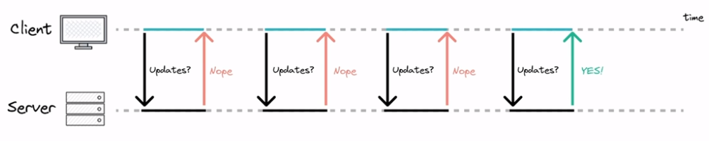

#### Push approach
These are asynchronous.

Long-polling. 
The client connects to the server and makes a request. 
Instead of replying immediately, the server waits until there is an update and then sends the response.
If there is no update for a long time, the connection times out and the client must reconnect.
Server resources are tied up until the connection is closed, even if there is no update.
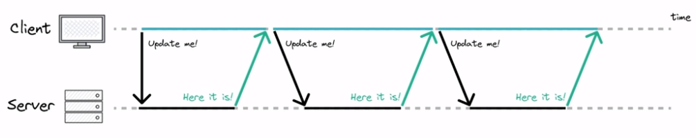

Websockets.
The client establishes a connection using an HTTP request and response. 
This establishes a TCP/IP connection for 2-way communication.
This allows for real-time applications without long-polling.
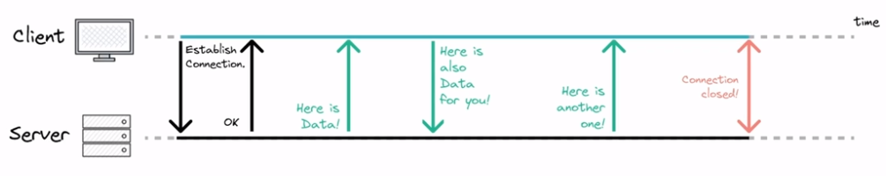

Server sent events.
Event-based approach.
EventSource API supported by all browsers.
The connection is 1-directional; the client can only pass data to the server at the point of connection. After that, only the server can send data to the client.
The server doesn't know if the client loses connection.


### 7.5. Message broker
A system component that implements asynchronous communication between services, decoupling them.
An independent server which producers and consumers connect to.
AKA message queues.

Message brokers persist the messages until there are consumers ready to receive them.

Message brokers are similar in principle to databases since they persist data.
The differences are they: automatically delete messages after delivery, do not support queries, 
typically have a small working set, and notify clients about changes.

RabbitMQ, Kafka and Redis are open source message brokers.
Amazon, GCP and Azure have managed service implementations.

#### Point-to-point messaging
A one-to-one relationship between sender and receiver. Each message is consumed by exactly one receiver. 

The message broker serves as an abstraction layer.
The producer only sends to the broker. The receiver only receives from the broker. The services do not need to know about one another.
The broker also guarantees delivery, so the message does not get lost if the consumer is unavailable, it will retry. 
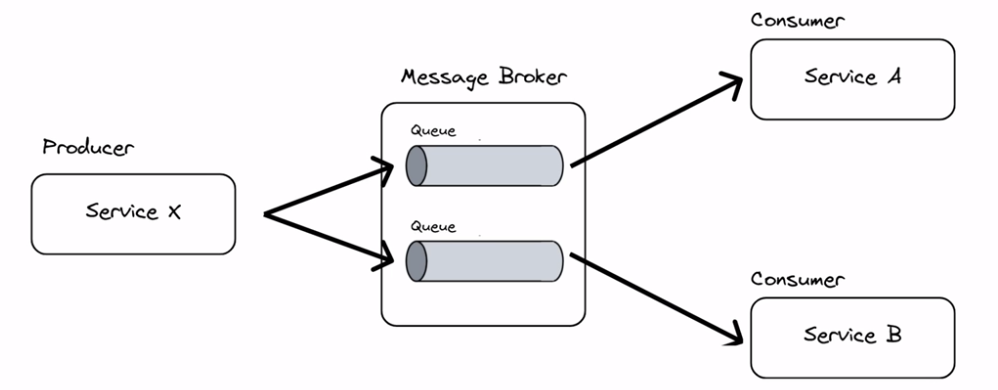

#### Pub/sub messaging
A one-to-many relationship between sender and receiver.
The publisher publishes to a certain topic. Any consumer who is interested can then subscribe to receive that message.
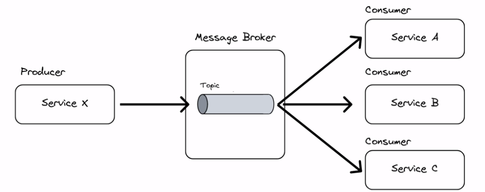

### 7.6. File storage
#### File-based
Files are stored in folders, with metadata about creation time and modification time.

Benefits: 
- Simplicity - simple and well-known pattern
- Compatibility - works with most applications and OSes

- Limitations:
- Performance degradation - as size increases, the resource demands increase.
- Expensive - although cheap in principle, they can get expensive when trying to work around the performance issues.

Use cases: data protection, local archiving, data retrieval done by users.

#### Object-based
A system component that manages data as objects in a flat structure. An object contains the file and its metadata.

Benefits:
- Horizontal scalability

Limitations:
- Objects must be edited as a unit - degrades performance if only a small part of the file needs to be updated.

Use cases: large amounts of unstructured data.

#### Block-based
A system component that breaks up and then stores data as fixed-size blocks, each with a unique identifier.

Benefits:
- Highly structured - easy to index, search and retrieve blocks
- Low data transfer overheads
- Supports frequent data writes without performance degradation
- Low latency

Limitations:
- No metadata, so metadata must be handled manually
- Expensive

#### Document-based
A subclass of key-value stores, which hold computer-readable documents, like XML or JSON objects.

### 7.7. Video uploading
Issues:
- Massive files: 4TB for 4 hours of 4K video
  - How can we reliably upload very large files?
- Lots of different end-user clients/devices/connection speeds
  - How can we process and store a range of versions/resolutions?

Processing pipeline:
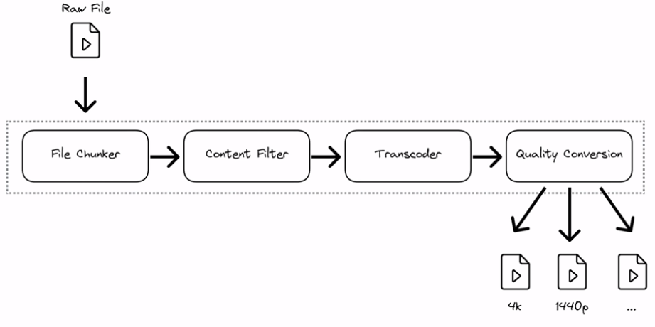

1. File chunker
   - Same principle as the file-sharing problem.
   - Split the file into chunks, then use checksums to determine that files are present and correct.
   - If there is a network outage, we only need to send the remaining chunks.
2. Content filter
   - Check if the video complies with the platform's content policy wrt copyright, piracy, NSFW
3. Transcoder
   - Data is decoded to an uncompressed format
   - This will fan out in the next step to create multiple optimised versions of the file
4. Quality conversion
   - Convert the uncompressed file into multiple different resolution options.

Architecture considerations:
- Wait for the full file to upload before processing? Or process each chunk as it is uploaded?
- An upload service persists chunks to a database. Object store is a good choice as in the file-sharing example.
- Once a chunk is ready to be processed, it can be read and placed in the message queue for the processing pipeline.
- The processing pipeline handles fixed-size chunks, so the hardware requirements are known ahead of time.
  A chunk can be processed as soon as a hardware unit becomes available.

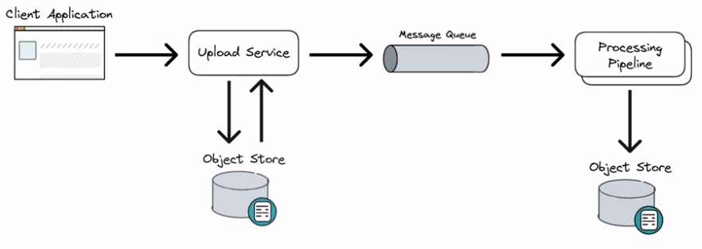

### 7.8. Video streaming
The challenges are similar to that of file-sharing, as this is essentially large files being transferred. 
Latency and processing power of the end-user device. 

Two main transfer protocols:
- UDP
- TCP

#### UDP
A connection-less protocol.
Nodes do NOT establish a stable end-to-end connection before sending data.
Instead, each packet has its destination address attached so the network can route it to the correct place.

Advantages:
- Fast
- Packets are routed independently so if some are lost the others can still reach their destination

Disadvantages:
- No guarantee that data will arrive intact.

Use cases:
- Low-latency applications like video conferencing or gaming.
- Not suitable for movie or audio streaming, as missing bits cannot be tolerated.

#### TCP
A connection is established between 2 nodes.
The nodes agree on certain parameters before any data is transferred.
Parameters: IP addresses of source and destination, port numbers of source and destination. 

Three-way handshake establishes the connection:
1. Sender transfers their sequence number to the Receiver.
2. Receiver acknowledges and sends its own sequence number.
3. Sender acknowledges.

Advantages:
- Reliability; guarantees delivery and receives acknowledgements before further packets are sent.
- Receiver acknowledgements ensure the receiver is able to process/buffer the data in time before more packets are sent.

Disadvantages:
- Slower due to error checking and resending lost packets.
- Requires three-way handshake to establish connection which is slower.

Use cases:
- Media streaming (HTTP live-streaming or MPEG-DASH)

Adaptive bitrate streaming
- TCP adjusts transmission speed in response to network conditions
- When packet loss is detected, smaller chunks are sent at a lower transmission speed. The lower resolution file can be sent in this case.


### 7.9. Cache and CDN
Perceived latency = Network latency + System latency

#### Cache
Caching is the process of storing copies of frequently accessed data in a temporary storage location. 

Caches utilise the difference in read performance between memory and storage.
Times to fetch 1MB from:
- HDD: 3 ms
- SSD: 0.2 ms
- RAM: 0.01 ms

When a user requests data it first requests from the cache
- Cache HIT: If the data is in the cache, return it
- Cache MISS: If the data is not in the cache, pass the request to the database, update the cache and return the data 

A cache can grow stale over time.
There are 2 common approaches to mitigate this:
1. Set up a time-to-live (TTL) policy within the cache
  - Trade off between short TTL (fresh data but worse performance) vs long TTL (data can be stale)
2. Implement active cache invalidation mechanism
  - Complicated to implement. Requires an "invalidation service" component to monitor and read from the database, then update the cache when necessary.

Application-level caching:
Insert caching logic into the application's source code to temporarily store data in memory.

Two approaches to application-level caching:
1. Query-based implementation
   - Hash the query as a key and store the value against the key in a key-value store.
   - Limitations: hard to delete cached result with a complex query; if a cell changes then all cached query which might include it need updating.
2. Object-based implementation
   - The result of a query is stored as an object
   - Benefits: only one serialisation/deserialisation overhead when reading/writing; complexity of object doesn't matter, serialized objects in cache can be used by multiple applications.

Popular implementations: Redis, Memcache, Hazlecast

#### Content Delivery Network (CDN)
A network of caching layer in different locations (Points of Presence, PoPs).
Full data is stored on SSD and most frequently accessed data is stored in RAM.

Don't cache dynamic or time-sensitive data.

Invalidating the cache.
You can manually update the CDN, but there may be additional caches at the ISP- and browser-level which would still serve 
stale data.
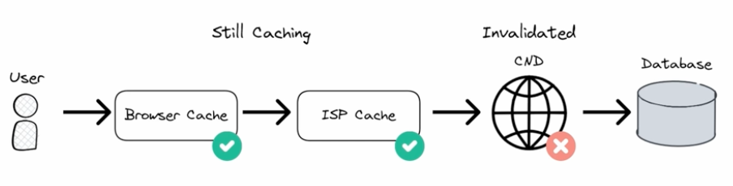

Approaches to invalidating cache:
- Caching headers - set a time when an object should be cleared, e.g. max-age=86400 caches for a day.
- Cache busting - change the link to all files and assets, so the CDN treats them like new files.


### 7.10 Search engine database
These are specialised NoSQL databases with the following benefits:
- Can match even with typos or non-exact matches
- Full-text search means you can suggest autocomplete results and related queries as the user types
- Indexing allows faster search performance on big data.

The database is structures as a hashmap where the inverted index points at documents.
- Document - Represents a specific entity, like a row in a relational database
- Inverted index - Maps from content to the documents that include it. The inverted index splits each document into individual search terms and makes each point to the document itself.
- Ranking algorithm - Produces a list of possibly relevant documents. Additional factors may impact this, like a user's previous search history.

The database is a dictionary of {search_term_id: [document_ids, ...]}
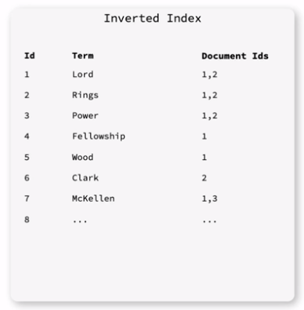

Popular implementations: Lucene, Elastic search, Apache solr, Atas search (MongoDB), Redis search.

Benefits of search engine databases:
- Scalable - NoSQL so scale horizontally
- Schemaless
- Works out of the box - just need ot decide upfront what attributes should be searchable.

Limitations:
- No ACID guarantees.
- Not efficient at reading/writing data, so requires another database to manage state. 
  - Maintaining consistency between the main database and the search engine database can be tricky.
- Some SQL databases have full-text search so may not require a dedicated search engine database.


## 8. System design examples and discussion
### 8.1. Todo App
An app that lets a user add and delete items from a todo list.
- Representation layer is a web app
- Microservices handle the todo CRUD operations and the user details separately
  - Each service is scaled horizontally, so a load balancer is placed in front of it
- Relational database stores data
  - There are two databases, one per service, which is an example of functional partitioning. 
    This means todo service I/O does not interfere with user service I/O and vice versa.

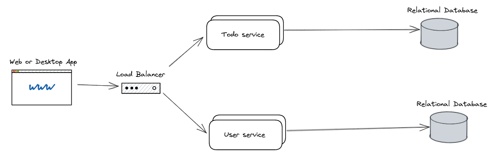

### 8.2. URL shorteners
Take an input URL and return a unique, shortened URL that redirects to the original.

Planned system architecture:
- Pre-generate all 5 digit keys (1 billion entries rather than 64 billion for 6 digits)
- System retrieves 5-difit keys from database
- System appends 1 out of 64 characters
- The system is extendable because if we run out of keys we can append 2 more characters rather than 1

#### Mock interview
System analysis:
- System is read heavy - Once a short URL is created it will be read multiple times
- Distributed system as this has to scale
- Availability > Consistency - not so much of a concern if a link isn't available to all users at the same time, 
  but they must be unique and lead to their destination.


**Requirements engineering:-**
Core feature:
- A user can input a URL of arbitrary length and receive a unique short URL of fixed size.
- A user can navigate to a short link and be redirected to the original URL.

Support features:
- A user can see their link history of all created short URLs.
- Lifecycle policy - links should expire after a default time span.

Non-functional requirements:
- Availability - the system should be available 99% of the time.
- Scalability - the system should support billions of short URLs, and thousands of concurrent users.
- Latency - the system should return redirect from a short URL to the original in under 1 second.

Questions to capture scale:
- Daily active users, and how often do users interact per day
  - 100 million, 1 interaction per day
- Peak active users - are there events that lead to traffic spikes?
  - No spikes
- Read/write ratio
  - 10 to 1
- Request size - how long are the originals URLs typically
  - 200 characters => 200 Bytes
- Replication factor
  - 1x - ignore replication

**Capacity estimation:-**
- Requests per second 
  - Reads per second = DAU * interactions per day / seconds in day = 10^8 * 1 / 10^5 = 1000 reads/s
  - Writes per second = Reads per second / read write ratio = 1000 / 10 = 100 writes/s
  - Requests per second = Reads per second + Writes per second = 1000 + 100 = 1100 requests/s
  - No peak loads to consider
- Bandwidth 
  - Bandwidth = Requests per second * Message size
  - Read bandwidth = 1000 * 200 Bytes = 200kB/s
  - Write bandwidth = 100 * 200 Bytes = 20 kB/s
- Storage
  - Storage per year = Write bandwidth * seconds per year * Replication factor = 20000 Bytes * (3600*24*365) * 1 = 630 GB


**Data model:-**
Identify entities, attributes and relationships.

Entities and attributes: 
- Links: Key (used to create short URL, Original URL, Expiry date
- Users: UserID, Links
- Key ranges: Key range, In use (bool)

Relationships:
- Users own Links
- Links belong to Key ranges

Data stores:
- Users
  - User data is typically relational and we rarely want it all returned at once. 
  - Consistency is important as we want the user to have the same experience regardless of which server handles their log in, and don't wat userIds to clash.
  - Relational database.
- Links
  - Non-functional requirements of low latency and high availability.
  - Data and relationships are not complex.
  - Key-value store.
- Key ranges
  - Favour data consistency as we don't want to accidentally reuse the same key range.
  - Filtering keys by status would help to find available key ranges.
  - Relational database.


**API design:-**
Endpoints:
- createUrl(originalUrl: str) -> shortUrl
  - response code 200, {shortURL: str}
- getLinkHistory(userId: str, sorting: {'asc', 'desc'})
  - response code 200, {links: [str], order: 'asc'}
- redirectURL(shortUrl: str) -> originalUrl
  - response code 200, {originalUrl: str}


**System design:-**
User flows for each of the required functional requirements.
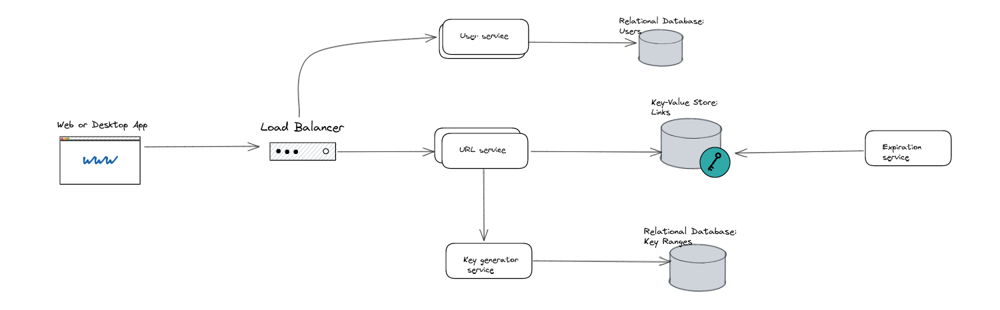

### 8.3. Dropbox file sharing
**Requirements engineering**
Requirements gathering:
- Read-heavy
- Distributed
- Data consistency is more important than availability - files should be consistent for all users

Core functional requirements:
1. A user can upload a file to the server
2. A user can download their files from the server

Secondary functional requirements:
1. A user can see a history of files uploaded and downloaded
2. A user can see who has downloaded a specific file and when

Non-functional requirements:
1. Consistency - data should be consistent across users and devices
2. Resilience - customer data should never be lost
3. Minimal latency
4. Compatibility across different devices
5. Security - multi-tenancy; customer data should be separate of one another

Questions to determine scale:
1. Daily active users
2. Peak active users - what events lead to a spike?
3. Interactions per user - how many file syncs, how many files does a user store
4. Request size - how large are files?
5. Read/write ratio
6. Replication factor

**Capacity estimation**
Throughput
- Peak write RPS = 2 peak load ratio * 10^8 users * 2 files/day / 10^5 seconds = 4000 RPS
- Peak read RPS = 10 read/write ration * 4000 write RPS = 40000 RPS
- Peak total RPS = 44000 RPS

Bandwidth
- Write bandwidth = 4000 Write RPS * 100 kB Request size = 400 MB/s
- Read bandwidth = 40000 Read RPS * 100 kB request size = 4 GB/s
- Total bandwidth = Write bandwidth + Read bandwidth = 4.4 GB/s

Storage
- Storage capacity = 5*10^8 Total users * 100 files per user * 1MB File Size * 3 Replication factor = 15*10^10 MB = 15000 TB

**Data model**
Users: Store Ids for the files that belong to them

Files: Metadata on the owner, file edit history, filename, size, chunks that comprise the file, version history

**API Design**
Endpoints:
- compareHashes(fileId: str, chunkHashes: list)
  - Takes a file ID and a list of chunk hashes and returns a list of the hashes that need resyncing .
  - response code 200, {syncChunks: [Hash,...]}
- uploadChange(fileId: str, chunks: list)
  - Upload the chunks to resync the file
  - response code 200, {message: "Chunks uploaded successfully"}
- requestUpdate(fileId: str, chunkHashes: list)
  - Update the local version of the file to match that on the server.
  - response code 200, {chunks: [Chunk,...]}

**System Design**
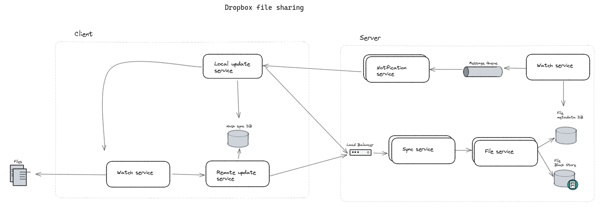

**Design Discussion**
- What can we do to achieve a scalable design?
  - Identify bottlenecks and remedy each.
- What can we do to achieve resiliency?


## References
- Udemy course https://www.udemy.com/course/the-bigtech-system-design-interview-bootcamp
- Excalidraw session https://excalidraw.com/#json=QM7dLZcHbESVnuTPiu06v,pdjPoskF0KknQ6YORHxeHw
- Capacity estimation cheat sheet in _resources folder
- Database book - "Designing Data-Intensive Applications: The Big Ideas Behind Reliable, Scalable, and Maintainable Systems" by Martin Kleppmann
- Rsync algorithm https://openresearch-repository.anu.edu.au/bitstream/1885/40765/3/TR-CS-96-05.pdf
- Search Engines Information Retrieval in Practice book https://ciir.cs.umass.edu/irbook/
