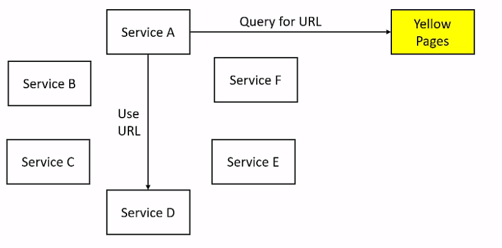
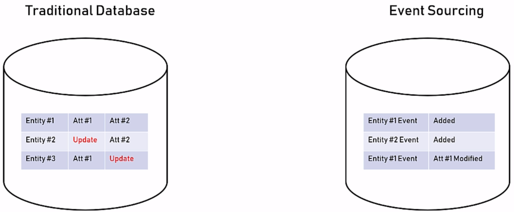

# Software Architecture Notes

Notes from udemy course https://www.udemy.com/course/the-complete-guide-to-becoming-a-software-architect/

## 1. What is a software architect
A developer knows what can be done, an architect knows what should be done. 
How do we use technology to meet business requirements. 

General system requirements:
- Fast
- Secure
- Reliable
- Easy to maintain

Architect's need to know how to code for:
- Architecture's trustworthiness
- Support developers
- Respect of developers

## 2. The architect's mindset
- Understand the business - Strengths, weaknesses, compettions, growth strategy.
- Define the system's goals - Goals are not requirements. Goals describe the effect on the organisation, requirements describe what the system should do.
- Work for your client's clients - Prioritise the end user.
- Talk to the right people with the right language - What is the thing that really matters to the person I'm talking to?
Project managers care about how things affect deadlines, developers care about the technologies used, CEOs care about business continuity and bottom line.

## 3. The architecture process
1. Understand the system requirements - What the system should do.
2. Understand the non-functional requirements - Technical and service level attributes, e.g. number of users, loads, volumes, performance.
3. Map the components - Understand the system functionality and communicate this to your client. 
Completely non-technical at this point, no mention of specific technologies. A diagram of high level components helps.
4. Select the technology stack - Backend, frontend, data store.
5. Design the architecture
6. Write the architecture document
7. Support the team

Include developers in non-functional requirements and architecture design for two reasons:
1. Learn about unknown scenarios early
2. Create ambassadors

## 4. System requirements
The 2 types of requirements: functional and non-functional.

### 4.1. Functional requirements
"What the system should do"

- Business flows
- Business services
- User interfaces

### 4.2. Non-functional requirements
"What the system should deal with"

- Performance - latency and throughput
  - Latency - How long does it take to perform a single task?
  - Throughput - How many tasks can be performed in a given time unit? 
- Load - Quantity of work without crashing. Determines the availability of the system. Always look at peak (worst case) numbers.
- Data volume - How much data will the system accumulate over time?
  - Data required on day one
  - Data growth (say, annually)
- Concurrent users - How many users will be using the system? This includes "dead times" which differentiates it from the load requirement.
Rule of thumb is concurrent_users = load * 10
- SLA - Service Level Agreement for uptime.

The non-functional requirements are generally the more important in determining the architecture.
The client will generally need guiding towards sensible values, otherwise they just want as much load as possible,
as much uptime as possible etc.

## 5. Application types
The application type should be established early based on the use case and expected user interaction.

- Web apps 
  - Serve html pages.
  - UI; user-initiated actions; large scale; short, focused actions.
  - Request-response model.
- Web API 
  - Serve data (often JSON).
  - Data retrieval and storage; client-initiated actions; large scale; short, focused actions.
  - Request-response model.
- Mobile
  - Require user interaction; frontend for web API; location-based.
- Console
  - No UI; limited interation; long-running processes; short actions for power users.
  - Require technical knowledge.
- Service
  - No UI; managed by service manager; long-running processes.
- Desktop
  - All resources on the PC; UI; user-centric actions.
- Function-as-a-service
  - AWS lambda

## 6. Select technology stack
Considerations:
- Appropriate for the task
- Community - e.g. stack overflow activity
- Popularity - google trends over 2 years

### 6.1. Backend technology
Covers web app, web API, console, service.

Options: .NET, JAva, node.js, PHP, Python

### 6.2. Frontend technology
Covers:
- Web app - Angular, React
- Mobile - Native (Swift, Java/Kotlin), Xamarin, React Native
- Desktop - depends on target OS

### 6.3. Data store technology
SQL - small, structured data
- Relational tables
- Transactions
  - Atomicity
  - Consistency
  - Isolation
  - Durability
- Querying language is universal

NoSQL - huge, unstructured or semi-structured data
- Emphasis on scale and performance.
- Schema-less, with entities stored as JSON.
- Eventual consistency - data can be temporarily inconsistent
- No universal querying language

## 7. The *-ilities
Quality attributes that describe technical capabilities to fulfill the non-functional requirements.
Non-functional requirements map to quality attributes, which are designed in the architecture.

- Scalability - Adding computing resources without any interruption. 
Scale out (add more compute instances) is preferred over scale up (increase CPU, RAM on the existing instance).
Scaling out introduces redundancy and is not limited by hardware.
- Manageability - Know what's going on and take action accordingly.
The question "who reports the problems" determines if a system is manageable. The system should flag problems, not the suer. 
- Modularity - A system that is built from blcoks that can be changed or replaced without affecting the whole system.
- Extensibility - Functionality of the system can be extended without modifying existing code. 
- Testability - How easy is it to test the application. Independent modules and methods and single responsibility principle aid testability.

## 8.Components architecture
A software component is a piece of code that runs in a single process.
Distributed systems are composed of independent software components deployed on separate processes/servers/containers.

Component architecture relates to the lower level details, whereas system architecture is the higher level view of how the components
fit together to achieve the non-functional requirements.

### 8.1. Layers
Layers represent horizontal functionality:
1. UI/SI - user interface or service interface (i.e. an API), authentication
2. Business logic - validation, enrichment, computation
3. Data access layer - connection handling, transaction handling, querying/saving data

Code can flow downwards by one layer only. It can never skip a layer and can never go up a layer.
This enforces modularity.

A service might sit across layers, for example logging sits across the 3 layers described above. 
In this case, the logging service is called a "sross-cutting concern".

Each layer should be independent of the implementation of other layers.
Layers should handle exceptions from those below them, log the error and then throw a more generic exception, so that 
there is no reference to other layers' implementation.

Layers are part of the same process. This is different from tiers, which are processes that are distributed across a network.

### 8.2. Interfaces
An interface declares the signature of an implementation. This means that each implementation must implement the methods described.
The abstract base class in Python is an example of this.

Close coupling should be avoided; "new is glue".

### 8.3. SOLID
1. Single responsibility principle: Each class, module or method should have exactly one responsibility. 
2. Open/closed principle: Software should be open for extension but closed for modification. Can be implemented using class inheritance.
3. Liskov substitution principle: If S is a subtype of T, then objects of type T can be replaced with objects of type S without altering the program.
This looks similar to polymorphism but is stricter; not only should the classes implement the same methods, but the behaviour of those methods
should be the same too, there should be no hidden functionality performed by S that is not performed by T or vice versa.
4. Interface segregation principle: Many client-specific interfaces are preferable to one general purpose interface.
5. Dependency inversion principle: High-level modules should depend on abstractions rather than concrete implementations.
Relies on dependency injection, where one object supplies the dependencies of another object.
A factory method determines which class to load and returns an instance of that class.
This also makes testing easier, as you can inject a mock class rather than having to mock out specific functionality.

### 8.4. Naming conventions
1. Structure - case, underscores
2. Content - class names should be nouns, methods should be imperative verbs

### 8.5. Exception handling
Some best practices:
1. Only catch exceptions if you are going to do something with it
2. Catch specific exceptions
3. Use try-catch on the smallest code fragments possible
4. Layers should handle exceptions raised by layers below them, without exposing the specific implementation of the other layer.
Catch, log, re-raise a more generic error.

Purposes of logging:
1. Track errors
2. Gather data

## 9. Design patterns
A collection of general, reusable solutions to common software design problems.
Popularised in the book "Design patterns: elements of reusable object-oriented software".

- The factory pattern: Creating objects without specifying the exact class of the object.
Avoids strong coupling between classes. 
Create an interface, then a factory method returns an instance of a class which implements that interface.
If the implementation needs to change, we only need to change the factory method.
- The repository pattern: Modules which don't work with the data store should be oblivious to the type of data store.
This is similar to the concept of the Data Access Layer. Layers are for architects, design patterns are for developers.
They both seek to solve the same issue.
- The facade pattern: Creating a layer of abstraction to mask complex actions.
The facade does not create any new functionality, it is just a wrapper integrating existing modular functions together.
- The command pattern: All the action's information is encapsulated within an object. 

## 10. System architecture
The architecture design is the big picture that should answer the following:
- How will the system work under heavy load?
- What will happen if the system crashes at a critical moment?
- How complicated is it to update?

The architecture should:
1. Define components
2. Define how components communicate
3. Define the system's quality attributes

Make the correct choice as early as possible

### 10.1. Loose coupling
Ensuring the services are not strongly tied to other services.
Avoid the "spiderweb" - when the graph of connections between services is densely connected.

Prevents coupling of platforms and URLs.

To avoid URL coupling between services, two options are:
- "Yellow pages" directory
- Gateway

The "yellow pages" contains a directory of all service URLs. 
If service A wants to query service D, A queries the yellow pages for D's URL, then uses that URL to query D.
This means that service A does not hardcode any information about service D.
If D's URLs change, then only the yellow pages need to be updated.
Services only need to know the yellow pages directory's URL.

The gateway acts as a middleman. It holds a mapping table of all URLs 
Service A queries the gateway, which in turn queries service E.
Service A doesn't need to know about E or any other services.
Services only need to know the gateway's URL.

### 10.2. Stateless
The application's state is stored in only 2 places:
1. The data store
2. The user interface

Stateless architecture is preferred in virtually all circumstances.

In a stateful architecture, when a user logs in, the login service retrieves the user details from the database and
stored them for future use. Data is stored in code.

If the login request was routed to server A, the user's details are stored there.
If the user later tried to add itemsto the cart and their cart service request is routed
to server B, then their user details will not exist as those are stored on server A.

Disadvantages of stateful:
- Lack of scalability
- Lack of redundancy

In a stateless architecture, no data is stored in the service itself.
This means the behaviour will be the same regardless of which server a request was routed to.

### 10.3. Caching
Caches store data locally to avoid retrieving the same data from the database multiple times.
It trades reliability of data (it is stored in volatile memory) for improved performance.

A cache should store data that is frequently accessed and rarely modified.

Two types of cache:
- In-memory cache - Cache stored in memory on a single service
  - Pros:
    - Best performance
    - Can store any objects
    - Easy to use
  - Cons:
    - Size is limited by the process's memory
    - Can grow stale/inconsistent if the service is scaled out to multiple servers 
- Distributed cache - Cache is independent of the services and can be accessed by all servers
  - Pros:
    - Supports scaled out servers
    - Failover capabilities
    - Storage is unlimited
  - Cons:
    - Setup is more complex
    - Often only support primitive data types
    - Worse performance than in-memory cache

### 10.4. Messaging
Messaging methods can be evaluated on these criteria:
- Performance
- Message size
- Execution model
- Feedback (handshaking) and reliability
- Complexity

Messaging methods include:
- REST API
- HTTP Push
- Queue
- File-based and database-based methods

#### REST API

Universal standard for HTTP-based systems.

Useful for traditional web apps.

| Criteria | Evaluation                                              |
| --- |---------------------------------------------------------|
| Performance | Very fast                                               |
| Message size | Same as HTTP protocol limitations - GET 8KB, POST ~10MB |
| Execution model | Request/response - ideal for quick, short actions       |
| Feedback | Immediate feedback via response codes                   |
| Complexity | Extremely easy                                          |

#### HTTP Push
A client subscribes to the service waiting for an event. 
When that event occurs, the server notifies the client.

For real-time messaging, these often use web sockets to maintain the subscription connection,
rather than a traditional request/response model.

Useful for chat or monitoring.

| Criteria | Evaluation                           |
| --- |--------------------------------------|
| Performance | Very fast                            |
| Message size | Limited, few KB                      |
| Execution model | Web socket connection / long polling |
| Feedback | None (fire and forget)               |
| Complexity | Extremely easy                       |

#### Queue
The queue sits between two (or more) services.
If service A wants to send a message to service B, A places the message in the queue
and B periodically pulls from the queue.

This ensures messages will be handled **exactly** once and in the order received.

Useful for complex systems with lots of data, when order and reliability are important.

| Criteria | Evaluation                                                                                                             |
| --- |------------------------------------------------------------------------------------------------------------------------|
| Performance | Slow - push/poll time and database persistence                                                                         |
| Message size | Unlimited but best practice to use small messages                                                                      |
| Execution model | Polling                                                                                                                |
| Feedback | Very reliable but feedback depends on the monitoring in place to ensure messages make it to the queue and get executed |
| Complexity | Requires training and setup to maintain a queue engine                                                                 |

#### File-based and DB-based
Similar to queue, but rather han placing messages in a queue it places them in a file directory or database.
There is no guarantee that messages are processed once and only once.

If multiple services are polling the same file folder, then when a new file is added we can get two issues:
1. File locked
2. Duplicate processing

Similar use case to queues, but queues are generally preferred.

| Criteria | Evaluation                                                        |
| --- |-------------------------------------------------------------------|
| Performance | Slow - push/poll time and database persistence                    |
| Message size | Unlimited                                                         |
| Execution model | Polling                                                           |
| Feedback | Very reliable but feedback depends on the monitoring              |
| Complexity | Requires training and setup to maintain the filestore or database |

### 10.5. Logging and monitoring
#### Central logging service
Create a central logging service that all other services call to write to a central database.
This solves the problem where each microservice has its own log format, data and location. 
For example, some might be in files, SQL database, NoSQL database, etc.

Implementation can be via an API or polling folders that each of the services write to.

#### Correlation ID
Correlation ID is an identifier attached to the beginning of a user flow and is attached to any action taken by that user,
so that if there is an error at any point the user flow can be traced back through the different services' logs. 

## 11. External considerations
External considerations can affect architecture and design decisions.
- Deadlines
- Dev team skills - New technologies can introduce uncertainty, delays and low quality
- IT support - Assign who will support the product from the outset. This should not be developers. 
- Cost - Build vs buy. Estimate cost vs value. Spend money to save time, don't spend time to save money.

## 12. Architecture document
This should describe the basic elements of the system:
- Technology stack
- Components
- Services
- Communication between components and services

No development should begin before the document is complete.

Goals of the document:
- Describe what should be developed and how
- List the functional and non-functional requirements

Audience:
- Everyone involved with the system: project manager, CTO, QA leader, developers
- Sections for management appear first as they are unlikely to read the whole document
- QA lead can begin preparing test infrastructure ahead of time

Format:
UML (universal modeling language) is often used. It visualises the system's design with concepts and diagrams.
However, this assumes the audience is familiar with UML which is often not the case.

- Keep the contents as simple as possible
- Use plain English
- Visualise using whatever software is comfortable and appropriate

Structure:
- Background
- Requirements
- Executive summary
- Architecture overview
- Components drill-down

#### Background
This section validates your point of view and instils confidence that you understand the project.

One page for all team and management.

Describe the system from a business POV:
- The system's role
- Reasons for replacing the old system
- Expected business impact

##### Requirements
Functional and non-functional requirements - what should the system do and deal with?
This section validates your understadning of the requirements. The requirements dictate the architecture so this
section sets the scene for the chosen architecture.

One page for all team and management.

This should be a brief, bullet point list of requirements with no more than 3 lines on each.

#### Executive summary
Provide a high-level view of the architecture.

Managers will not read the whole document; <3 pages for management.

- Use charts and diagrams
- Write this after the rest of the document
- Use technical terms sparsely and only well known ones
- Be concise and don't repeat yourself

#### Architecture overview
Provide a high-level view of the architecture in technical terms.
Do not deep dive into specific components

<10 pages for developers and QA lead.

- General description: type and major non-functional requirements
- High-level diagram of logical components, no specifics about hardware or technologies
- Diagram walkthrough: describe the various parts and their roles
- Technology stack: iff there is a single stack include it here, otherwise include it in the components drill down section

#### Components drill down
Detailed description of each component.

Unlimited length, for developers and QA lead.

For each component:
- Component's role
- Technology stack: Data store, backend, frontend
- Component's architecture: Describe the API (URL, logic, response code, comments). Describe the layers. Mention design patterns here.
- Development instructions: Specific development guidelines
 
Be specific and include rationale behind decisions.

## 13. Advanced architecture topics
These architecture patterns solve specific problems but add complexity to the system, so the costs and benefits should be compared.

### 13.1. Microservices 
An architecture in which functionalities are implemented as separate, loosely coupled services that interact with each other using a standard lightweight protocol.

Problems with monolithic services:
- A single exception can crash the whole process
- Updates impact all components
- Limited to one development platform/language
- Unoptimised compute resources
 
With microservices, each service is independent of others so can be updated separately, use a different platform, and be optimised separately.

An example of splitting a monolithic architecture into microservices:

Problems with microservices:
- Complex monitoring of all services and their interactions
- Complex architecture
- Complex testing

### 13.2. Event sourcing
Storing the deltas to each entity rather than updating it.
The events can then be "rebuilt" from the start to give a view of the state at any given point in time.

Use when history matters.

Pros:
- Tracing history
- Simple data model
- Performance
- Reporting

Cons:
- No unified view - need to rebuild all events from the start to see the current state
- Storage usage

### 13.3. CQRS
Command query responsibility segregation.
Data storage and data retrieval are two separate databases, with a sync service between the two.

This integrates nicely with event sourcing, where events (deltas) are stored in one database and the 
current state is periodically built and stored in the retrieval database.

Pros:
- Useful with high-frequency updates that require near real-time querying

Cons:
- Complexity - need 2 databases, a sync service, ETL between the storage and retrieval database

## 14. Soft skills
The architect is often not the direct line manager of the developers implementing the software.
You ultimately work with people, not software.
**Influence without authority** is key.

- Listening - assume you are not the smartest person in the room, collective wisdom is always better.
- Dealing with criticism
  - Genuine questioning: Provide facts and logic, be willing to go back and check again
  - Mocking: Don't attack back, provide facts and logic
- Be smart not right
- Organisational politics - be aware of it but don't engage in it
- Public speaking - define a goal, know your audience, be confident, don't read, maintain eye contact
- Learning - blogs (DZone, InfoQ, O'Reilly), articles, conferences

## References
- Udemy course https://www.udemy.com/course/the-complete-guide-to-becoming-a-software-architect/
- Design patterns https://refactoring.guru/
